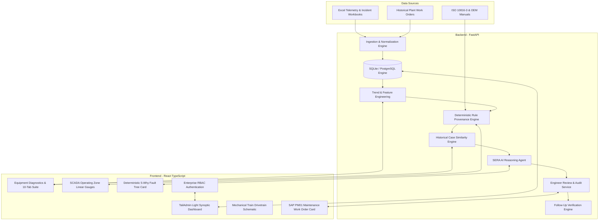

# SERA — System for Equipment Reliability Assessment
> **Tagline**: *Detect. Investigate. Decide.*

[](#)
[](https://www.python.org/)
[](https://fastapi.tiangolo.com/)
[](https://react.dev/)
[](https://tailwindcss.com/)
[-success.svg)](#)

---

## 📌 Executive Summary

**SERA (System for Equipment Reliability Assessment)** is an industrial-grade manufacturing reliability decision-support platform engineered for **CALIBER 2026 Case 2: "Intelligent Manufacturing Unified Dashboard"**.

Industrial plants suffer millions of dollars in downtime because disparate SCADA telemetry, vendor thresholds, laboratory oil analyses, and maintenance work orders exist in isolated silos. When critical equipment degrades (such as the **BL-5702 Synthesis Gas Recycle Blower** in Cilegon Petrochemical Complex), engineers lack a unified diagnostic platform that bridges raw telemetry with physics-based failure analysis and proven historical cases.

SERA bridges this gap through a deterministic **Evidence-First Architecture**:
1. **Deterministic Rule Engine & Engineering Calculations** form the bedrock of truth (zero hallucinations).
2. **AI Investigation Agent** operates strictly as an explanation and reasoning synthesis layer.
3. **The Lead Reliability Engineer** retains final review and sign-off authority before work orders are released to the field.

```
Data Ingestion (Excel/SCADA)
       ↓
Deterministic Rule & Trend Engine (ISO 10816-3 / Vendor Limits)
       ↓
Measured Engineering Evidence Layer (What Changed?)
       ↓
Historical Incident Pattern Match (TF-IDF Cosine Retrieval)
       ↓
Root Cause Analysis (5-Why Fault Tree Propagation)
       ↓
Maintenance Action Plan (SAP PM01 Work Order)
       ↓
Lead Engineer Review & Sign-Off (Human-in-the-Loop RBAC)
       ↓
Post-Turnaround Follow-Up & Verification ("Did It Work?")
```

---

## 🏢 Core System Architecture

SERA is built with an enterprise decoupling pattern:



---

## ✨ Key Differentiators & Features

| Differentiator | Generic AI Dashboard | SERA Enterprise Reliability System |
| :--- | :--- | :--- |
| **Calculation Accuracy** | LLM predicts numbers (hallucination risk) | **100% Deterministic Python calculations** with linear regressions & FFT ratios |
| **Rule Traceability** | Black-box output | **Rule Provenance**: Every threshold cites standard (e.g. ISO 10816-3, OEM Manual) |
| **Physical Context** | Generic SaaS graphs & AI cards | **Interactive Mechanical Train Schematic** showing Motor $\rightarrow$ Coupling $\rightarrow$ Bearings |
| **Actionable Output** | Vague bullet recommendations | **SAP PM01 Work Order** with required tooling (XT770), shims (304SS), and LOTO PTW |
| **Human-in-the-Loop** | AI takes action unchecked | **Lead Engineer Sign-Off**: Mandatory `ACCEPT`, `MODIFY`, or `REJECT` state machine |
| **Verification Loop** | Closes after turnaround | **"Did It Work?" Follow-Up**: Delta reduction matrix comparing Before vs After |
| **Security & RBAC** | Single login | **4 Industrial Personas**: Reliability Lead, Maintenance Tech, Plant Manager, Data Eng |
| **Localization** | Monolingual English | **100% Bilingual**: English & Bahasa Indonesia with instant language switch |

---

## 🎯 Official CALIBER Case 2 Fleet & Main Showcase: BL-5702

SERA ingests and models all **5 official CALIBER 2026 Case 2 assets** across plant sections:
1. **BL-5702 (Product Blower)** — Centrifugal Blower, Orion Polypropylene Plant (OPP), Powder Handling Section (Criticality High, Class A, Linked AR: `AR-2026-OPP-0203`)
2. **PU-2101B (Feed Charge Pump)** — Centrifugal Pump, Aromatics Plant (ARP) (Linked AR: `AR-2026-ARP-0117`)
3. **KO-3201 (Wet Gas Compressor)** — Centrifugal Compressor, Pyrolysis Gasoline Plant (PGP) (Linked AR: `AR-2026-PGP-0045`)
4. **PM-4405B (Extruder Main Drive Motor)** — Heavy Industrial Motor, Pelleting Section, SMX Plant (Linked AR: `AR-2026-SMX-0089`)
5. **HE-3301 (Reboiler Heat Exchanger)** — Shell & Tube Heat Exchanger, Distillation Section, OP2 Plant (Linked AR: `AR-2026-OP2-0112`)

### Golden Showcase Failure & Recovery Profile (BL-5702)
- **Baseline (Weeks 01–05)**: Vibration nominal at $4.10\text{ mm/s}$ (ISO Zone A/B), 2X harmonic at $1.28\text{ mm/s}$, offset at $0.033\text{ mm}$, bearing temp at $60.6^\circ\text{C}$.
- **Onset of Degradation (Weeks 06–20)**: Progressive shaft radial misalignment caused by 0.12 mm motor soft-foot and aged elastomer spider element (>12 months).
- **Critical Trip Event (Week 21 — 17 Jun 2026 04:30)**:
  - Overall Vibration: $\mathbf{11.22\text{ mm/s}}$ (Trip Limit $\ge 11.00\text{ mm/s}$, Alarm $\ge 7.00\text{ mm/s}$)
  - 2X Rotational Harmonic: $\mathbf{5.10\text{ mm/s}}$ (Trip Limit $\ge 5.00\text{ mm/s}$, Alarm $\ge 3.00\text{ mm/s}$ — dominant 2X misalignment signature)
  - Radial Coupling Offset: $\mathbf{0.306\text{ mm}}$ (Trip Limit $\ge 0.300\text{ mm}$, Alarm $\ge 0.050\text{ mm}$)
  - Drive-End Bearing Temperature: $\mathbf{96.9^\circ\text{C}}$ (Trip Limit $\ge 95.0^\circ\text{C}$, Alarm $\ge 80.0^\circ\text{C}$)
  - Outage Impact: **14.0 hours downtime**, **532.0 tons production lost**, **$478,800 USD financial loss**
- **Deterministic SERA Action**: Isolates coupling misalignment and soft-foot via 4P and 4M+1E verification, retrieves top matching historical cases from the 380-incident archive (`PZ-3313B 94.2%`, `PM-2566C 91.0%`, `KO-2904 88.5%`), generates CAPA/PAA action plan, and records Lead Reliability Engineer review sign-off.
- **Closed-Loop Verification ("Did It Work?", Week 22 — 24 Jun 2026)**:
  - Overall Vibration dropped to $\mathbf{3.782\text{ mm/s}}$ ($-66.3\%$ reduction, returned to ISO Zone A)
  - 2X Harmonic dropped to $\mathbf{1.243\text{ mm/s}}$ ($-75.6\%$ reduction)
  - Radial Coupling Offset dialed to $\mathbf{0.030\text{ mm}}$ ($-90.2\%$ reduction, within $<0.05\text{ mm}$ OEM spec)
  - Bearing Temperature cooled to $\mathbf{60.74^\circ\text{C}}$ ($-37.3\%$ reduction, nominal thermal envelope)

---

## 🚀 Quick Start Guide

### Prerequisites
- Python 3.10, 3.11, or 3.12
- Node.js 18+ and npm 9+
- Modern Web Browser (Chrome, Edge, Firefox)

### 1. One-Click Unified Launch (PowerShell)
From the repository root:
```powershell
.\start.ps1
```
This script automatically:
1. Validates Python and Node.js environments.
2. Ingests all official CALIBER Case 2 workbooks (`ingest_official_caliber_data.py`) into SQLite (`sera.db`).
3. Launches the FastAPI backend API server at `http://localhost:8000`.
4. Launches the Vite React frontend client at `http://localhost:5173`.

### 2. Manual Setup (Alternative)

**Backend Setup:**
```bash
cd sera
# Activate virtual environment (.venv)
.venv\Scripts\activate    # Windows
# or: source .venv/bin/activate  # Linux/macOS

pip install -r backend/requirements.txt

# Ingest official CALIBER Case 2 datasets into sera.db:
python scripts/ingest_official_caliber_data.py

# Start FastAPI server on port 8000:
cd backend
python -m uvicorn main:app --reload --host 0.0.0.0 --port 8000
```
Backend API live at: `http://localhost:8000` (Swagger UI: `http://localhost:8000/docs`).

**Frontend Setup:**
```bash
cd sera/frontend
npm install
npm run dev
```
Frontend UI live at: `http://localhost:5173`.

---

## 🧪 Testing & Verification

SERA includes a comprehensive compliance test suite verifying all 15 core architectural requirements:

```bash
cd sera/backend
python tests/test_sera_pipeline.py
```

Expected Output:
```
==================================================================
TEST EXECUTION SUMMARY: 16 PASSED, 0 FAILED (TOTAL 16)
ALL 15 COMPLIANCE & INTEGRATION TEST SUITES PASSED 100%!
==================================================================
```

Frontend production bundle verification:
```bash
cd sera/frontend
npm run build
```

---

## 📚 Complete Documentation Index

All in-depth technical documentation is available in the [`docs/`](docs/) directory:

| Document | Description |
| :--- | :--- |
| [**System Overview**](docs/system-overview.md) | High-level purpose, problem context, philosophy, and boundaries |
| [**Architecture**](docs/architecture.md) | Component architecture, runtime diagrams, and data flows |
| [**Data Flow**](docs/data-flow.md) | Step-by-step data transformation pipeline |
| [**Database Schema**](docs/database.md) | Relational database schema, ER diagrams, indexes, and migrations |
| [**API Specification**](docs/api.md) | Complete OpenAPI/REST endpoint documentation (13+ routes) |
| [**Frontend Architecture**](docs/frontend.md) | React 18, Tailwind CSS, Montserrat design tokens, and components |
| [**Backend Engine**](docs/backend.md) | FastAPI services, repository pattern, and worker pipelines |
| [**Rule Engine & Provenance**](docs/rule-engine.md) | ISO 10816-3 rules, vendor thresholds, and evaluation logic |
| [**Engineering Analytics**](docs/analytics.md) | Mathematical formulation of regressions, slopes, and FFT ratios |
| [**Evidence System**](docs/evidence-system.md) | Deterministic evidence layer and "What Changed?" calculation |
| [**Historical Analysis**](docs/historical-analysis.md) | TF-IDF & Cosine similarity incident retrieval |
| [**AI Investigation Agent**](docs/ai-agent.md) | Reasoning synthesis prompt design and fallback resiliency |
| [**Root Cause Analysis (RCA)**](docs/rca.md) | 5-Why Fault Tree mechanical failure propagation |
| [**Recommendation Engine**](docs/recommendation.md) | Corrective/preventive plans and SAP PM01 work order structure |
| [**Engineer Review Workflow**](docs/engineer-review.md) | Human-in-the-loop authorization states and audit logging |
| [**Follow-Up Verification**](docs/follow-up.md) | "Did It Work?" before-vs-after delta verification |
| [**Security & RBAC**](docs/security.md) | Role-based access control, persona permissions, and auth |
| [**Configuration**](docs/configuration.md) | Environment variables, threshold settings, and LLM config |
| [**Installation Guide**](docs/installation.md) | Complete step-by-step developer and server setup |
| [**Deployment Guide**](docs/deployment.md) | Docker Compose, reverse proxy (Nginx), and production setup |
| [**Testing Suite**](docs/testing.md) | Test suite breakdown, unit tests, and integration coverage |
| [**Troubleshooting**](docs/troubleshooting.md) | Common errors, port conflicts, database locks, and fixes |
| [**Demo & Judging Guide**](docs/demo-guide.md) | 5-minute hackathon pitch script and judging walkthrough |
| [**Limitations**](docs/limitations.md) | Known technical assumptions and operating envelope boundaries |
| [**Future Roadmap**](docs/roadmap.md) | Phase 2/3 vision: IoT streaming, OPC-UA, automated SAP RFC |
| [**Glossary**](docs/glossary.md) | Domain terminology for vibration analysis & industrial reliability |
| [**User Guide**](docs/user-guide.md) | Operator and maintenance technician user manual |
| [**FAQ**](docs/faq.md) | Frequently asked questions by developers, judges, and plant leads |

---

## 👥 Hackathon Team & Project Metadata
- **Event**: CALIBER 2026 Hackathon
- **Case Challenge**: Case 2 — *Intelligent Manufacturing Unified Dashboard*
- **Team**: SERA Engineering Team
- **Plant Context**: Cilegon Petrochemical Complex — Unit 05 (Synthesis Gas & Utilities)
- **License**: Proprietary / CALIBER 2026 Hackathon Submission
