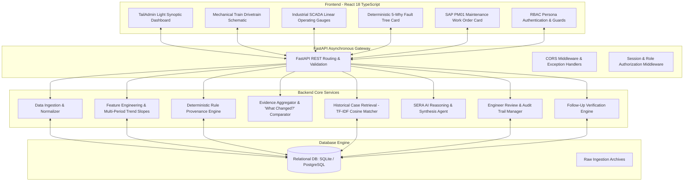
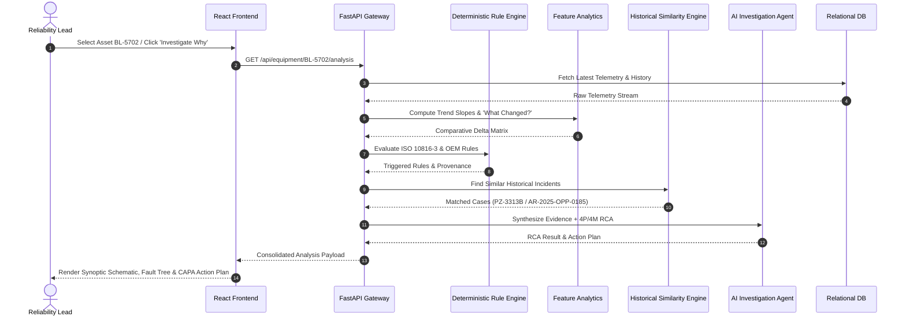
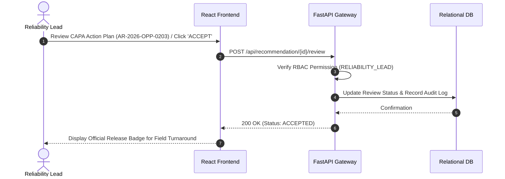

# SERA — System Architecture Documentation

---

## 1. High-Level Architecture Overview

SERA is built with an enterprise three-tier decoupled architecture:

1. **Presentation Layer (Frontend)**: React 18 SPA with TypeScript, TailwindCSS Light Theme (TailAdmin architecture), Montserrat typography, and custom industrial SCADA/Drivetrain visual components.
2. **Application & Intelligence Layer (Backend)**: Python FastAPI asynchronous API service hosting the Deterministic Rule Engine, Engineering Analytics, Evidence Aggregator, Historical Similarity Engine, and AI Investigation Agent.
3. **Data Persistence Layer (Database)**: Relational database (SQLite for zero-config demo / PostgreSQL for production enterprise scaling) with SQLAlchemy ORM and structured migration schema.

---

## 2. Component Specifications

### 2.1 Ingestion & Normalization Engine (`services/ingestion.py`)

- **Purpose**: Ingests raw multi-tab Excel workbooks, validates data types, extracts parameters, and normalizes column schemas.
- **Input**: Raw Excel file or batch folder (`.xlsx`, `.xls`).
- **Processing**:
  - Validates sheet presence (`Telemetry`, `Incidents`, `Thresholds`, `Equipment_Master`).
  - Imputes missing timestamps and casts numeric values (`vibration`, `harmonic_2x`, `coupling_offset`, `bearing_temperature`).
  - Applies database upserts to prevent duplicated readings.
- **Output**: Persisted records in `telemetry_records`, `equipment_master`, `historical_incidents`.
- **Dependencies**: `pandas`, `openpyxl`, `SQLAlchemy`.

### 2.2 Feature Engineering & Analytics Engine (`services/analytics.py`)

- **Purpose**: Computes mathematical health features, multi-period linear regression trend slopes, rolling moving averages, and vibration harmonic ratios.
- **Input**: Ordered sequence of telemetry records for target asset.
- **Processing**:
  - Calculates 4-week, 8-week, and 12-week rate of change:
    $$
    \text{Slope } m = \frac{N \sum (t \cdot x) - \sum t \sum x}{N \sum t^2 - (\sum t)^2}
    $$
  - Calculates 2X/1X rotational harmonic ratio:
    $$
    \text{Harmonic Ratio } R_{2X} = \frac{\text{Vib}_{2X}}{\text{Vib}_{\text{RMS}}}
    $$
  - Compares current 4-week operating window with baseline commissioning window (Weeks 01–04) to build the "What Changed?" matrix.
- **Output**: `WhatChangedData`, `TrendData`, anomaly score indicators.
- **Dependencies**: `numpy`, `scipy`.

### 2.3 Deterministic Rule Provenance Engine (`services/rule_engine.py`)

- **Purpose**: Evaluates parameter values against international engineering standards and OEM threshold tables with complete provenance citation.
- **Input**: Telemetry snapshot (`vibration`, `bearing_temperature`, `coupling_offset`, `harmonic_2x`).
- **Processing**:
  - Evaluates rule priority hierarchy:
    1. **OEM Interlock Trip Limits** (Priority 1)
    2. **ISO 10816-3 Class III/IV Vibration Velocity Standards** (Priority 2)
    3. **Plant Operating Envelope Alarm Guidelines** (Priority 3)
  - Flags condition status: `NORMAL`, `WARNING`, `ALARM`, `TRIP` / `CRITICAL`.
- **Output**: `RuleTraceData` (triggered rules, exact threshold, source reference, engineering rationale).
- **Dependencies**: None (pure deterministic Python).

### 2.4 Historical Incident Similarity Engine (`services/historical_search.py`)

- **Purpose**: Searches plant incident archives for past equipment breakdowns with matching mechanical symptoms.
- **Input**: Equipment type, active symptom keywords, and parameter breach vector.
- **Processing**:
  - Tokenizes problem statements and root cause narratives.
  - Builds TF-IDF sparse matrix over historical incident records.
  - Computes Cosine Similarity metric:
    $$
    \text{Similarity}(q, d) = \frac{\mathbf{q} \cdot \mathbf{d}}{\|\mathbf{q}\| \|\mathbf{d}\|}
    $$
  - Ranks top historical candidates with verified corrective action histories.
- **Output**: Top $K$ `IncidentRecord` objects with confidence ranking.
- **Dependencies**: `scikit-learn`, `numpy`.

### 2.5 SERA AI Investigation Agent (`services/investigation_agent.py`)

- **Purpose**: Synthesizes structured deterministic evidence, mathematical trend derivatives, and historical precedents into an engineering narrative.
- **Input**: `EvidenceItem[]`, `RuleTraceData`, `WhatChangedData`, and `Incident[]`.
- **Processing**:
  - Strictly bound to provided factual evidence payload (prompt constraint forbids hallucinated numbers).
  - Integrates resilient deterministic fallback mode in case of LLM connectivity timeout or unavailability.
- **Output**: `RCAResult` (Primary root cause, 5-Why failure propagation chain, corrective & preventive action plans).
- **Dependencies**: `google-genai` / `openai` with automatic rule-based fallback.

### 2.6 Engineer Review & Sign-Off Service (`services/review_service.py`)

- **Purpose**: Manages the human-in-the-loop state machine for work order authorization.
- **Input**: Review submission payload (`review_status: 'ACCEPTED' | 'MODIFIED' | 'REJECTED'`, `engineer_notes`, `reviewed_by`, `final_action`).
- **Processing**:
  - Validates RBAC permission (`canApproveRecommendations`).
  - Logs immutable audit timestamp and reviewer credentials.
  - Transitions recommendation record state.
- **Output**: Updated `Recommendation` record.
- **Dependencies**: `AuthService`, `Database`.

### 2.7 Post-Maintenance Follow-Up Engine (`services/follow_up.py`)

- **Purpose**: Computes recovery efficacy by comparing post-maintenance telemetry against pre-maintenance trip condition.
- **Input**: Pre-turnaround condition and post-turnaround commissioning snapshot.
- **Processing**:
  - Calculates absolute and percentage reduction for all parameters:
    $$
    \Delta \% = \frac{\text{Before} - \text{After}}{\text{Before}} \times 100\%
    $$
  - Verifies if machine returned to ISO Zone A ($< 3.8\text{ mm/s}$).
- **Output**: `FollowUpRecord` with `verification_result: 'VERIFIED_RECOVERED'`.
- **Dependencies**: `Database`.

---

## 3. Runtime & Execution Flows

### 3.1 Investigation & Diagnostics Flow

### 3.2 Review & Authorization Flow

