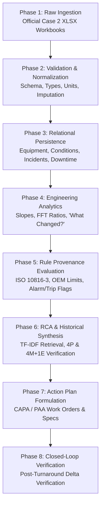

# SERA — Data Flow Architecture

---

## 1. End-to-End Data Pipeline

The SERA data pipeline transforms raw, noisy industrial spreadsheets and SCADA historian telemetry into verified engineering actions through 8 sequential transformation phases:

---

## 2. Phase-by-Phase Transformation Details

### Phase 1: Raw Ingestion
- **Official CALIBER Case 2 Datasets**:
  - `Equipment Performance - RCA*.xlsx`: 5 asset workbooks, 26 weekly condition records each = **130 records**.
  - `Production Data - RCA*.xlsx`: 5 asset workbooks, 720 hourly PI process tag records each = **3,600 records**.
  - `Incident Database.xlsx`: **380 real plant incident records** across plants ($67.2M financial losses, 2,261.1h downtime).
- **Protocols**: Automated batch ingestion via `scripts/ingest_official_caliber_data.py` on startup or on-demand upload via `/api/ingestion/upload`.

### Phase 2: Validation & Normalization
- **Timestamp Standardization**: Converts all timestamps to ISO 8601 UTC format (`YYYY-MM-DDTHH:MM:SSZ`).
- **Engineering Unit Alignment**:
  - Vibration Velocity: $\text{mm/s RMS}$ (ISO Standard).
  - Rotational Harmonics (2X): $\text{mm/s peak}$.
  - Shaft Centerline Offset: $\text{mm}$ (Radial & Axial).
  - Temperature: Degrees Celsius ($^\circ\text{C}$).
  - Flow / Feed: Metric tons per hour ($\text{T/H}$) and liters per minute ($\text{L/min}$).
  - Pressure: Bar ($\text{bar}$).
- **Data Integrity Checks**: Rejects non-numeric telemetry values, handles negative values appropriately, and handles null values gracefully.

### Phase 3: Relational Persistence
- Populates normalized database tables in SQLite (`sera.db`):
  - `equipment`: Core asset metadata, tag codes, service types, locations, downtime totals.
  - `equipment_conditions`: Time-series weekly sensor measurements linked to `equipment_id`.
  - `production_records`: 3,600 hourly PI process sensor tag records (`feed`, `pressure`, `flow_rate`, `vibration_sensor`, `motor_amp`).
  - `incidents`: 380 past failure archives with problem, root cause, corrective, and preventive action texts.
  - `rca_results`: Official 4P and 4M+1E verification records (`AR-2026-OPP-0203`).
  - `recommendations`: Turnaround CAPA and preventive PAA action plans.
  - `follow_ups`: Post-maintenance verified recovery records.

### Phase 4: Engineering Analytics & Feature Generation
- **Rolling Windows**: Computes rolling 4-week mean ($\mu$) and standard deviation ($\sigma$).
- **Multi-Period Linear Regression Slopes**:
  - Computes weekly rate of change over 4, 8, and 12-week windows.
- **Harmonic Energy Ratio**:
  $$R_{2X} = \frac{\text{Harmonic}_{2X}}{\text{Vibration}_{\text{RMS}}}$$
  A ratio $R_{2X} > 0.40$ indicates severe misalignment dominance over unbalance or bearing defect frequencies.
- **"What Changed?" Matrix**:
  - Baseline: Weeks 01–05 (Healthy commissioned state).
  - Previous: Week 20 (Onset of critical alarm).
  - Current: Week 21 (Severe trip condition: $11.22\text{ mm/s}$).
  - Computes absolute delta ($\Delta$) and percentage variance ($\Delta\%$).

### Phase 5: Rule Provenance Evaluation
- Runs telemetry against equipment-specific OEM and ISO thresholds:
  1. OEM Trip Interlocks ($\text{Vibration} \ge 11.0\text{ mm/s}$, $\text{Coupling Offset} \ge 0.300\text{ mm}$, $\text{DE Temp} \ge 95.0^\circ\text{C}$, $\text{2X Harmonic} \ge 5.0\text{ mm/s}$).
  2. ISO 10816-3 Zone Boundaries ($\text{Zone D} \ge 7.10\text{ mm/s}$).
  3. Operating Guideline Alarms ($\text{DE Temp} \ge 80.0^\circ\text{C}$, $\text{2X Harmonic} \ge 3.0\text{ mm/s}$, $\text{Offset} \ge 0.050\text{ mm}$).
- Builds the **Evidence Item Layer** with exact rule citations, observed measurements, thresholds, and severity ratings.

### Phase 6: RCA & Historical Synthesis
- **Vector Search**: Computes cosine similarity between current evidence keywords and the 380 historical incident records.
- **4P & 4M+1E Failure Matrix Generation**: Deduces deterministic mechanical causal progression:
  $$\text{Symptom (Vib Trip 11.22)} \rightarrow \text{Harmonic (2X Surge 5.10)} \rightarrow \text{Mechanical (Offset 0.306)} \rightarrow \text{Origin (0.12mm Soft-Foot & Aged Spider)} \rightarrow \text{Root Cause (PM Check Gap)}$$

### Phase 7: Action Plan Formulation
- Converts RCA finding into structured **CAPA / PAA Action Plan** (AR-2026-OPP-0203):
  - Corrective: Replace cracked elastomer spider, re-shim baseplate to fix 0.12 mm soft-foot, laser alignment to $<0.05\text{ mm}$.
  - Preventive: Add 6-monthly alignment inspection to PM routine, 12-month elastomer register, weekly vibration routes.
  - Production Impact: 14.0 hours outage, 532.0 tons protected, $478,800 USD loss prevented.

### Phase 8: Closed-Loop Follow-Up Verification
- Post-turnaround telemetry ingestion compares new steady-state values (Week 22) with trip baseline (Week 21):
  - $\text{Vibration}: 11.22 \rightarrow 3.782\text{ mm/s}\;(-66.3\%)$
  - $\text{2X Harmonic}: 5.10 \rightarrow 1.243\text{ mm/s}\;(-75.6\%)$
  - $\text{Offset}: 0.306 \rightarrow 0.030\text{ mm}\;(-90.2\%)$
  - $\text{DE Bearing Temp}: 96.9 \rightarrow 60.74^\circ\text{C}\;(-37.3\%)$
  - $\text{Status}: \text{TRIP} \rightarrow \text{NORMAL (Zone A)}$
- Confirms successful turnaround and archives case into the historical knowledge repository.
