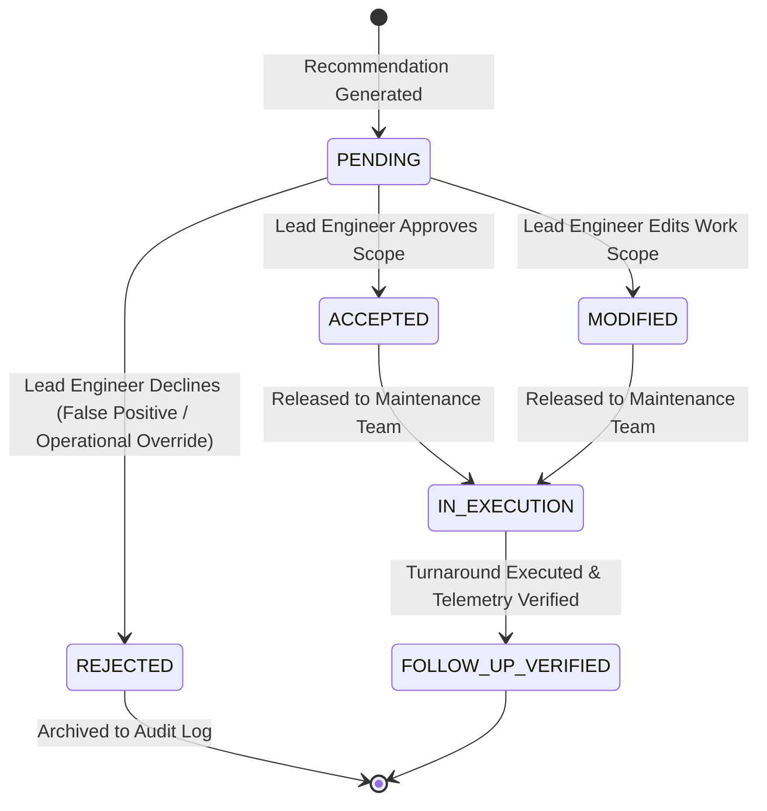

# SERA — Engineer Review & Authorization Workflow

---

## 1. Human-in-the-Loop Governance

A central architectural mandate of SERA is:
> **AI never releases work orders to the plant floor autonomously. The Lead Reliability Engineer remains the final authorizing decision maker.**

The Engineer Review module establishes an auditable state machine for all maintenance recommendations.

---

## 2. Review State Machine

### Review Actions:
- **`ACCEPTED`**: The engineer agrees with the proposed root cause and corrective work order as drafted. The work order is immediately tagged `RELEASED FOR FIELD EXECUTION`.
- **`MODIFIED`**: The engineer adjusts tooling requirements, shifts outage schedules, or adds specific plant safety precautions before authorization.
- **`REJECTED`**: The engineer overrides the diagnostic output (e.g. if an operational transient caused a momentary false trip) and provides mandatory written justification in the audit log.

---

## 3. RBAC Enforcement on Review

Only authenticated users with the `canApproveRecommendations` permission (specifically `RELIABILITY_LEAD`) can submit sign-offs. Maintenance technicians or data engineers attempting to submit review authorizations receive a `403 Forbidden` error and are guided to request lead engineer approval.

---

## 4. Audit Log Data Contract

Every review action captures:
- `recommendation_id`: Unique recommendation UUID.
- `equipment_id`: Target machine tag.
- `review_status`: `ACCEPTED` / `MODIFIED` / `REJECTED`.
- `engineer_notes`: Written comments entered by the engineer.
- `reviewed_by`: Name or discipline ID (e.g. `Lead Reliability Engineer (ROT-01 / REL-05)`).
- `reviewed_at`: Immutable UTC timestamp.
- `final_action`: The exact authorized field work scope dispatched to maintenance crews.
