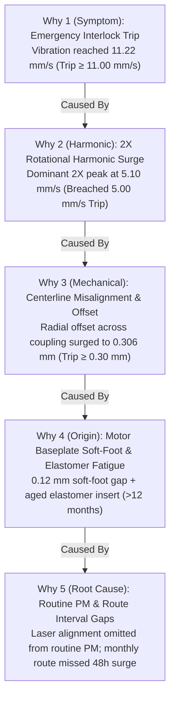

# SERA — Root Cause Analysis (RCA), 4P & 4M+1E Verification

---

## 1. Root Cause Analysis Methodology

In industrial reliability engineering, jumping directly from an overall vibration alarm to a quick symptom fix (e.g. adding grease or resetting trips) without identifying the core mechanical mechanism often results in recurrent catastrophic trips within weeks.

SERA implements a structured multi-layered investigation methodology combining:
1. **4P Parameter Verification Matrix** (Phenomenon/Physical Parameter testing)
2. **4M + 1E Verification** (Method, Material, Measurement, Man, Environment)
3. **5-Why Mechanical Fault Tree** tracing symptoms to root maintenance gaps

---

## 2. 4P Parameter Verification Matrix (BL-5702 Case)

Derived directly from official Abnormality Report **AR-2026-OPP-0203**:

| # | Phenomenon / Parameter | Result | Engineering Evidence & Diagnostic Finding |
|---|---|:---:|---|
| **P1** | Overall Vibration above alarm | NG | Vibration reached $11.22\text{ mm/s}$ vs $7.0\text{ mm/s}$ alarm limit — classic 2X misalignment signature. |
| **P2** | Coupling alignment out of tolerance | NG | Offset measured $0.35\text{ mm}$ dial reading vs $< 0.05\text{ mm}$ spec — combined angular and parallel misalignment. |
| **P3** | Bearing condition degraded | G | Bearing envelope shock-pulse normal — no internal bearing race spalling or defect. |
| **P4** | Foundation / Soft-Foot | NG | Soft-foot $0.12\text{ mm}$ found on motor drive-end foot — contributed to frame distortion and shaft angularity. |
| **P5** | Rotor unbalance | G | 1X rotational component within standard ISO 1940 balance grade — unbalance eliminated. |

---

## 3. 4M + 1E Verification (Root Cause Breakdown)

| Dimension | Verification Item | Result | Official Engineering Evidence |
|---|---|:---:|---|
| **Method (X1)** | PM Checklist Completeness | **NG** | Routine PM did not include periodic laser alignment and soft-foot inspection checks. |
| **Material (X2)** | Coupling Element Integrity | **NG** | Flexible elastomer insert operated beyond 12-month design life, leading to hardening and cracks. |
| **Measurement (X3)** | Monitoring Interval | **NG** | Monthly vibration route interval was too long to capture the 2-day rapid rise to trip. |
| **Man (X4)** | Technician Competency | **G** | Laser alignment kit and trained mechanical technicians available on site. |
| **Environment** | Ambient / Plant Context | **G** | OPP powder-handling section ventilation and foundation stability nominal. |

---

## 4. Failure Mode Classification Taxonomy Across Fleet

SERA's diagnostic rules evaluate failure modes across all 5 plant asset classes:

| Asset | Failure Mode | Primary Spectral / Physical Signature | Correlated Sensors | Root Mechanism |
| :--- | :--- | :--- | :--- | :--- |
| **BL-5702** | **Shaft Coupling Misalignment** | Dominant **2X** harmonic peak ($5.10\text{ mm/s}$) | Coupling offset ($0.306\text{ mm}$), DE bearing temp ($96.9^\circ\text{C}$) | Angular/parallel shaft offset aggravated by 0.12 mm motor soft-foot and aged elastomer element. |
| **PU-2101B** | **Mechanical Seal Degradation** | Low seal flush flow ($<4.0\text{ L/min}$) | Discharge pressure drop, casing vibration | Flush restriction leading to seal face dry running and thermal scoring. |
| **KO-3201** | **Radial Vibration & Lube Contamination** | High radial shaft vibration ($>75\,\mu\text{m}$) | Lube oil water contamination ($>500\text{ ppm}$), oil supply pressure drop | Moisture in lube loop reducing oil film thickness on tilt-pad bearings. |
| **PM-4405B** | **Motor Overcurrent & Winding Heat** | Elevated phase current ($>380\text{ A}$) | Stator winding temperature ($>130^\circ\text{C}$), DE bearing heat | Heavy pelletizer mechanical resistance inducing motor overload and thermal degradation. |
| **HE-3301** | **Heat Exchanger Tube Fouling** | High tube-side $\Delta P$ ($>1.2\text{ bar}$) | Low heat duty ($<70\%$), cold outlet temperature drop | Heavy polymer wax deposition on inner tube walls reducing heat transfer coefficient. |
