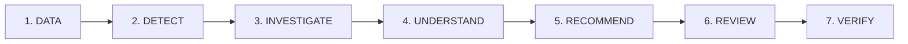

# SERA — System Overview
> **Tagline**: *Detect. Investigate. Decide.*

---

## 1. What is SERA?

**SERA (System for Equipment Reliability Assessment)** is an industrial decision-support system designed specifically for plant reliability engineers, condition monitoring specialists, and maintenance operations teams in heavy process industries (petrochemicals, oil & gas, power generation, and manufacturing).

SERA serves as a unified intelligence cockpit that ingests continuous equipment condition monitoring data, detects mechanical anomalies deterministically using international engineering standards (e.g. ISO 10816-3, OEM thresholds), correlates anomalies with historical plant maintenance records, generates comprehensive Root Cause Analyses (RCA), structures SAP-ready maintenance action plans, and tracks post-maintenance recovery ("Did It Work?").

---

## 2. Why Does SERA Exist? (The Problem Context)

In modern manufacturing and petrochemical plants (such as the **Orion Polypropylene Plant (OPP)** and adjacent complex units ARP, PGP, SMX, OP2):

1. **Siloed Data Landscapes**: SCADA DCS historian logs, vibration spectral analyses, oil laboratory reports, and SAP Plant Maintenance work order histories exist across disconnected software tools.
2. **Alert Fatigue & Delayed Action**: When high vibration or thermal warnings occur, operators are overwhelmed by hundreds of simultaneous alarm tags without clear root cause localization.
3. **Lost Institutional Knowledge**: Experienced plant engineers retire, taking decades of troubleshooting experience with them. When a critical machine like the **BL-5702 Product Blower** suffers shaft misalignment, junior engineers often treat the symptom (e.g. adding grease or resetting trips) rather than resolving the core mechanical defect.
4. **Catastrophic Financial Loss**: Unplanned outages in continuous process loops cost between **$50,000 to $500,000+ per event** in production losses, flaring costs, and equipment damage (e.g. $478,800 USD lost in the BL-5702 14-hour trip).

---

## 3. Core Philosophy: The Three Pillars of SERA

```
┌────────────────────────────────────────────────────────┐
│  Pillar 1: Data-First Deterministic Evidence           │
│  "Engineering calculations and rule provenance are the │
│   uncompromising factual evidence. Zero hallucination."│
├────────────────────────────────────────────────────────┤
│  Pillar 2: AI as Reasoning & Explanation Layer         │
│  "AI synthesizes structured evidence and historical    │
│   cases into coherent human-readable diagnoses."       │
├────────────────────────────────────────────────────────┤
│  Pillar 3: Human-in-the-Loop Final Decision Maker      │
│  "The Lead Reliability Engineer retains full and final │
│   authority to approve, modify, or reject work orders."│
└────────────────────────────────────────────────────────┘
```

### What SERA Is:
- ✅ A **Reliability Decision-Support System** that empowers engineers with evidence and historical patterns.
- ✅ A **Deterministic Diagnostics Engine** that strictly follows ISO 10816-3 standards and OEM specifications across all 5 plant assets (`BL-5702`, `PU-2101B`, `KO-3201`, `PM-4405B`, `HE-3301`).
- ✅ A **Closed-Loop System** that tracks recommendations through review, field execution, and post-turnaround verification.

### What SERA Is NOT:
- ❌ **NOT an Autonomous Plant Controller**: SERA does not send direct shutdown commands to DCS controllers without human confirmation.
- ❌ **NOT a Generic Chatbot / AI SaaS**: SERA does not rely on generative LLMs for numerical calculations or threshold evaluation.
- ❌ **NOT an Unverified Black Box**: Every rule trigger and recommendation provides full mathematical provenance and reference documentation.

---

## 4. End-to-End Operational Workflow

SERA operationalizes a 7-step deterministic reliability workflow:



1. **DATA (Ingestion & Normalization)**: Ingests raw telemetry workbooks (130 weekly records across 5 assets, 3,600 hourly PI process tags, 380 plant incidents) directly into SQLite (`sera.db`).
2. **DETECT (Rule & Threshold Engine)**: Evaluates live telemetry against equipment-specific OEM thresholds and ISO 10816-3 limits (`NORMAL`, `WARNING`, `ALARM`, `TRIP`).
3. **INVESTIGATE (What Changed? Analysis)**: Compares current operating period against healthy baseline to generate deterministic percentage deltas and evidence cards.
4. **UNDERSTAND (RCA & Historical Match)**: Matches failure symptom signatures against historical plant incident archives using TF-IDF cosine similarity and builds 4P and 4M+1E root cause verification matrices.
5. **RECOMMEND (Action Plan Generation)**: Generates specific corrective turnaround actions (precision laser alignment, elastomer spider replacement, soft-foot shimming) and preventive recurrence controls.
6. **REVIEW (Engineer Sign-Off)**: Lead Reliability Engineer reviews the generated plan, inputs field notes or modifies work scope, and authorizes the work order (`ACCEPT`, `MODIFY`, `REJECT`).
7. **VERIFY (Post-Maintenance Follow-Up)**: Following turnaround execution, SERA evaluates post-maintenance telemetry to confirm whether vibration returned to ISO Zone A and calculates percentage reduction.

---

## 5. Main Showcase Asset: BL-5702 Product Blower

The primary showcase scenario implemented in SERA models **BL-5702 (Product Blower)** at the **Orion Polypropylene Plant (OPP)**, Powder Handling Section:
- **Service**: Critical Class-A rotating blower handling continuous 38 T/H polymer powder conveyance (Discipline: ROT, Linked Abnormality Report: `AR-2026-OPP-0203`).
- **Failure Timeline**:
  - **Baseline (Weeks 01–05)**: Nominal baseline operations ($4.10\text{ mm/s}$ vibration, $1.28\text{ mm/s}$ 2X harmonic, $0.033\text{ mm}$ offset, $60.6^\circ\text{C}$ bearing temperature).
  - **Deterioration Period (Weeks 06–20)**: Gradual coupling disc elastomer hardening/fatigue and motor soft-foot gap ($0.12\text{ mm}$) driving radial shaft deflection.
  - **Interlock Trip Event (Week 21 — 17 Jun 2026 04:30)**:
    - Overall Vibration: $\mathbf{11.22\text{ mm/s}}$ (Trip threshold $\ge 11.00\text{ mm/s}$, Alarm $\ge 7.00\text{ mm/s}$)
    - 2X Rotational Harmonic: $\mathbf{5.10\text{ mm/s}}$ (Trip threshold $\ge 5.00\text{ mm/s}$, Alarm $\ge 3.00\text{ mm/s}$)
    - Radial Coupling Offset: $\mathbf{0.306\text{ mm}}$ (Trip threshold $\ge 0.300\text{ mm}$, Alarm $\ge 0.050\text{ mm}$)
    - DE Bearing Temperature: $\mathbf{96.9^\circ\text{C}}$ (Trip threshold $\ge 95.0^\circ\text{C}$, Alarm $\ge 80.0^\circ\text{C}$)
    - Plant Impact: 14.0 hours unplanned downtime, 532.0 tons lost polymer production, $478,800 USD financial loss.
- **Resolution & Verification (Week 22 — 24 Jun 2026)**:
  - SERA isolates coupling misalignment and soft-foot as primary root cause.
  - Retrieves top historical matches: `PZ-3313B (94.2%)`, `PM-2566C (91.0%)`, `KO-2904 (88.5%)`.
  - Releases turnaround work order: soft-foot re-shimmed with 304SS shims, elastomer spider replaced, laser alignment dialed into $0.030\text{ mm}$ offset ($<0.05\text{ mm}$ spec).
  - Confirms Week 22 recovery: Vibration dropped to $\mathbf{3.782\text{ mm/s}}$ ($-66.3\%$, ISO Zone A), 2X harmonic dropped to $\mathbf{1.243\text{ mm/s}}$ ($-75.6\%$), bearing temperature normalized to $\mathbf{60.74^\circ\text{C}}$ ($-37.3\%$). Blower restored to full 38 T/H load.
